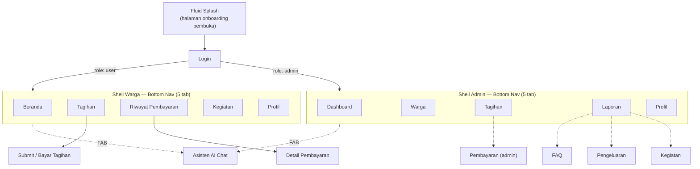
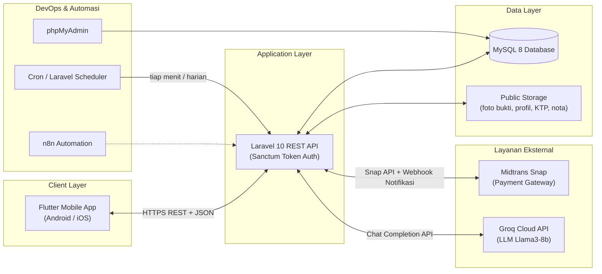
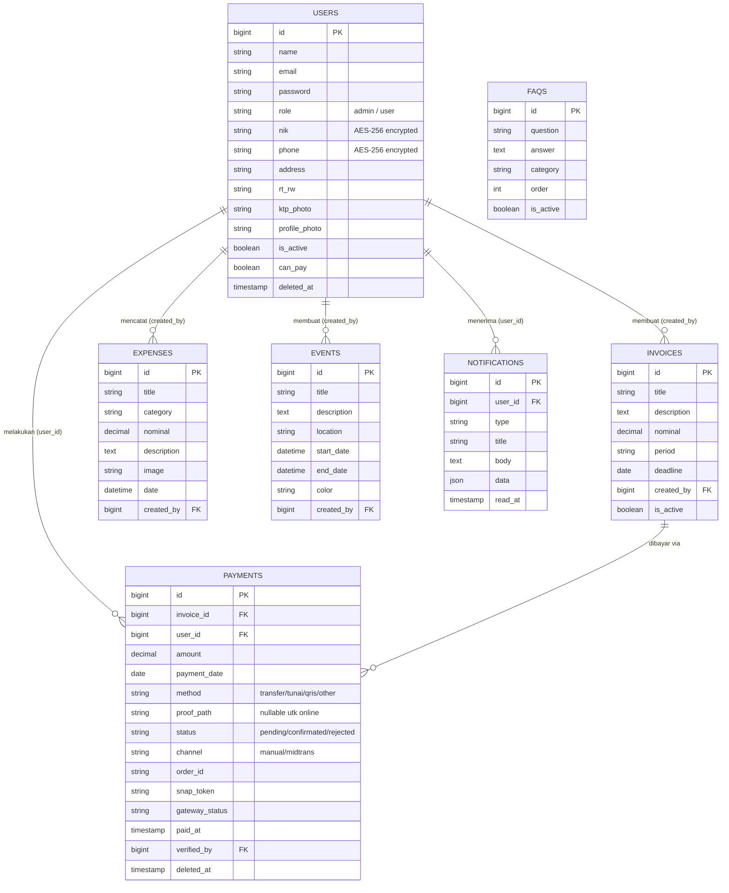
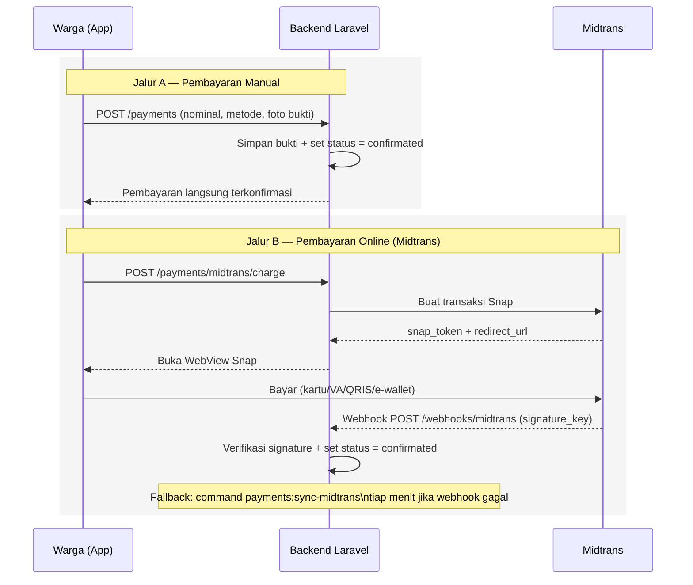

# Kelompok 3 Sistem Informasi A2
- Nazwa Ima Fadia 20241320084
- Muhammad Ilyas Fauzi 20241320090
- Julia Desteny Deodonia Langkedeng 20241320066
- Muhammad Rifqy Wildan 20241320055
- Aal Maulana Rahmat 20241320071
- Gilang Bungsu Putra Anugrah 20241320082
- Wahyu Bonita Juliana Sari 20241320079
- Caryksha Aulia Putri 20241320052

<div align="center">

#  ARUSKAS RT
### Sistem Manajemen Warga & Keuangan RT/RW Berbasis Digital


**Digitalisasi pencatatan iuran, pengeluaran, dan administrasi warga RT/RW —
lengkap dengan pembayaran online otomatis dan asisten AI.**

</div>

---

> **ARUSKAS RT** *(Arus Kas RT)* — pada level kode backend masih memakai nama
> proyek awal **"Perelek"** (`composer.json`, `APP_NAME`, domain contoh
> `@perelek.local`) — adalah sistem manajemen iuran & keuangan RT/RW yang
> terdiri dari **REST API backend (Laravel 10)** dan **aplikasi mobile
> (Flutter)**. Aplikasi ini dilengkapi pembayaran online otomatis via
> **Midtrans Snap**, asisten **AI Chat** kontekstual berbasis **Groq LLM**,
> serta enkripsi data sensitif warga.

##  Daftar Isi

1. [Profil Proyek](#1--profil-proyek)
2. [Pengenalan Aplikasi](#2--pengenalan-aplikasi)
3. [Fungsi & Fitur](#3--fungsi--fitur)
4. [Tampilan Aplikasi (UI/UX)](#4--tampilan-aplikasi-uiux)
5. [Arsitektur & Infrastruktur](#5--arsitektur--infrastruktur)
6. [Cara Penggunaan](#6--cara-penggunaan)
7. [Instalasi Teknis](#7--instalasi-teknis)
8. [Dokumentasi API](#8--dokumentasi-api)
9. [Struktur Proyek](#9--struktur-proyek)
10. [Keamanan](#10--keamanan)
11. [Akun Demo](#11--akun-demo)
12. [Lisensi](#12--lisensi)

---

## 1.  Profil Proyek

| Atribut | Keterangan |
|---|---|
| **Nama Aplikasi** | ARUSKAS RT (nama paket internal: `aruskas_rt`) |
| **Nama Kode Backend** | Perelek (`perelek/backend`) |
| **Kategori** | Aplikasi manajemen keuangan & administrasi komunitas RT/RW |
| **Platform** | Mobile (Android/iOS) untuk pengguna, REST API untuk backend |
| **Arsitektur** | Monorepo — `backend/` (API) dan `frontend/` (mobile app) terpisah, berkomunikasi via JSON REST API |
| **Backend** | Laravel 10, PHP 8.1+, Laravel Sanctum (token auth) |
| **Frontend** | Flutter 3.x (Dart 3.x), Provider (state management), GoRouter (navigasi) |
| **Database** | MySQL 8 / MariaDB 10+ |
| **Payment Gateway** | Midtrans Snap (sandbox & production) |
| **AI Provider** | Groq Cloud API (model `llama3-8b-8192`) |
| **Bahasa Aplikasi** | Bahasa Indonesia (default locale `id_ID`, tersedia `en_US`) |
| **Lisensi** | MIT |
| **Status** | Aktif dikembangkan — sudah tersedia seed data demo (30 warga, Jan 2024–Jun 2026) |

---

## 2.  Pengenalan Aplikasi

### Latar Belakang

Pengelolaan iuran dan kas RT/RW secara manual (buku catatan, grup chat,
kertas kwitansi) rawan terhadap beberapa masalah:

-  **Tidak transparan** — warga sulit memantau ke mana uang iuran dipakai.
-  **Rawan human error** — pencatatan manual mudah selisih atau hilang.
-  **Proses bayar merepotkan** — warga harus bertemu langsung bendahara/RT.
-  **Rekap laporan lambat** — laporan bulanan/tahunan dibuat manual dari nol.

### Solusi yang Ditawarkan

ARUSKAS RT menjawab masalah tersebut lewat aplikasi mobile dua-peran
(**Warga** & **Admin/Pengurus RT**) yang terhubung ke satu backend terpusat:

-  Warga bisa melihat tagihan, membayar langsung dari HP (online), dan memantau riwayat pembayarannya sendiri.
-  Admin bisa membuat tagihan, mencatat pengeluaran, memantau saldo kas
  secara real-time, dan mengelola data warga tanpa berkas fisik.
-  Transparansi anggaran dapat diakses publik (tanpa login) sehingga warga
  yang belum terdaftar sekalipun bisa memantau kas RT.
-  Pembayaran online via **Midtrans** langsung terverifikasi otomatis oleh
  sistem — tidak ada lagi proses "menunggu dikonfirmasi admin".
-  Asisten **AI Chat** menjawab pertanyaan warga/admin seputar tagihan,
  saldo, dan rincian keuangan berdasarkan data real-time mereka sendiri.

### Dua Peran Pengguna

| Peran | Kode `role` | Deskripsi |
|---|---|---|
|  **Admin / Pengurus RT** | `admin` | Mengelola seluruh data: warga, tagihan, pengeluaran, kegiatan, FAQ, dan laporan keuangan. |
|  **Warga** | `user` | Melihat & membayar tagihan sendiri, riwayat pembayaran, kegiatan, dan laporan personal. |

---

## 3.  Fungsi & Fitur

### 3.1 Fitur untuk Warga

| Fitur | Deskripsi |
|---|---|
| **Dashboard Personal** | Ringkasan total bayar tahun berjalan, tagihan belum lunas dengan tombol bayar langsung, pengumuman & kegiatan mendatang. |
| **Tagihan (Invoices)** | Melihat daftar tagihan aktif beserta status lunas/belum. |
| **Pembayaran Manual** | Submit pembayaran dengan upload foto bukti transfer/QRIS/tunai — otomatis berstatus terkonfirmasi begitu terkirim. |
| **Pembayaran Online (Midtrans)** | Bayar langsung lewat Snap (kartu kredit, VA, e-wallet, QRIS) dalam WebView aplikasi; status terkonfirmasi otomatis lewat webhook. |
| **Riwayat Pembayaran** | Filter berdasarkan status (`confirmated`/`rejected`/`pending`), lihat detail & preview bukti pembayaran full-screen. |
| **Laporan Personal** | Rekap total iuran yang sudah dibayar per periode. |
| **Transparansi Anggaran** | Grafik pemasukan vs pengeluaran RT secara publik/warga. |
| **Kalender Kegiatan** | Lihat jadwal kegiatan RT (rapat, kerja bakti, dll.) dalam tampilan kalender interaktif. |
| **FAQ & Panduan** | Accordion FAQ dan tab panduan penggunaan aplikasi step-by-step. |
| **Notifikasi** | Notifikasi in-app untuk status pembayaran, pengumuman, dsb. |
| **Asisten AI Chat** | Tanya jawab dengan asisten AI yang tahu konteks data pribadi pengguna (tagihan, riwayat bayar, kegiatan) dan FAQ aplikasi. |
| **Profil** | Edit data diri, foto profil (kamera/galeri), ganti password. |
| **Kirim Laporan ke Admin** | Warga dapat mengirim laporan/aduan yang langsung muncul di notifikasi admin. |

### 3.2 Fitur untuk Admin / Pengurus RT

| Fitur | Deskripsi |
|---|---|
| **Dashboard Admin** | Statistik total warga, pemasukan, pengeluaran, saldo kas, grafik tren bulanan, daftar pembayaran terbaru. |
| **Manajemen Warga** | CRUD data warga (nama, NIK terenkripsi, No. HP terenkripsi, alamat, RT/RW, foto KTP & profil), pencarian & filter. |
| **Nonaktifkan Akun** (`is_active`) | Menonaktifkan login warga sepenuhnya (mis. warga pindah rumah). |
| **Nonaktifkan Tombol Bayar** (`can_pay`) | Warga tetap bisa login & lihat tagihan, tapi tombol "Bayar" disembunyikan/diblokir — untuk kasus keringanan sementara. |
| **Manajemen Tagihan** | Buat, edit, hapus tagihan (nominal, periode, jatuh tempo) untuk seluruh warga. |
| **Pemantauan Pembayaran** | Melihat seluruh transaksi pembayaran (manual & online) dengan filter status/pencarian nama warga. |
| **Manajemen Pengeluaran** | Catat pengeluaran kas RT per kategori, lengkap dengan foto bukti nota. |
| **Laporan Keuangan** | Laporan keuangan lengkap per periode, laporan tunggakan per tagihan, transparansi anggaran bulanan. |
| **Manajemen Kegiatan** | CRUD jadwal kegiatan RT dengan color-picker untuk kalender. |
| **Manajemen FAQ** | CRUD FAQ & kategori yang tampil ke warga (sekaligus jadi basis pengetahuan Asisten AI). |
| **Notifikasi** | Menerima notifikasi real-time saat ada laporan/pembayaran dari warga. |
| **Asisten AI Chat (Admin)** | Bertanya seputar ringkasan kas, rincian keuangan per bulan/tahun, daftar warga yang berpotensi menunggak, dsb — dijawab berdasarkan data live. |

### 3.3 Fitur Lintas Sistem (Otomatisasi Backend)

| Fitur | Deskripsi |
|---|---|
| **Auto-Sync Midtrans** | Command terjadwal `payments:sync-midtrans` berjalan tiap menit sebagai jaring pengaman jika webhook Midtrans gagal terkirim. |
| **Webhook Midtrans** | Endpoint publik dengan verifikasi `signature_key` (SHA-512) untuk konfirmasi status pembayaran otomatis dari server Midtrans. |
| **Backup Otomatis** | Backup database harian pukul 02:00 WIB + pembersihan log lama (>30 hari) via Laravel Scheduler. |
| **Cache Layer** | Dashboard admin/warga & data transparansi publik di-cache (60–120 detik) untuk performa, otomatis di-invalidate saat ada perubahan pembayaran. |
| **Enkripsi Data Sensitif** | NIK & nomor HP warga dienkripsi otomatis (AES-256) sebelum disimpan ke database. |

---

## 4.  Tampilan Aplikasi (UI/UX)

> Repositori ini belum menyertakan berkas *screenshot*. Bagian ini
> menjelaskan desain sistem & peta layar aplikasi berdasarkan kode sumber,
> agar tim dapat menambahkan tangkapan layar aktual ke folder
> `docs/screenshots/` dan menautkannya di sini.

### 4.1 Desain Sistem

| Elemen | Nilai |
|---|---|
| **Font** | Poppins (Regular/Medium/SemiBold/Bold) — UI utama; DM Serif Display, Marcellus SC, Lexend — halaman *fluid splash* |
| **Warna Primer** | `#FF6B35` (oranye hangat) — brand utama |
| **Warna Aksen** | `#0E9F6E` (hijau) — status sukses/lunas |
| **Warna Status** | Pending `#FFF3CD`, Confirmated `#D1FAE5`, Rejected `#FEE2E2` |
| **Mode Tampilan** | *Daylight* (terang, latar `#FAF7F5`) & *Midnight* (gelap, latar `#101114`) |
| **Sistem Desain** | Material 3, berbasis kartu (*card-based*), sudut membulat 14–16px |
| **Navigasi** | Bottom navigation bar melengkung (*curved navigation bar*) dengan Floating Action Button "Tanya Asisten AI" |

### 4.2 Peta Navigasi Aplikasi



### 4.3 Ringkasan Layar Utama

| Layar | Peran | Ringkasan Tampilan |
|---|---|---|
| **Fluid Splash** | Semua | Halaman pembuka animatif (carousel *fluid*) sebelum masuk ke Login. |
| **Login** | Semua | Form email & password dengan validasi real-time, animasi, dan fitur "Lupa Password". |
| **Dashboard Admin** | Admin | Kartu statistik (warga, pemasukan, pengeluaran, saldo), grafik tren garis (`fl_chart`), daftar pembayaran terbaru, menu cepat. |
| **Dashboard Warga** | Warga | Banner total bayar tahun berjalan, kartu tagihan belum lunas + tombol "Bayar", pengumuman & kegiatan mendatang. |
| **Kelola Warga** | Admin | List warga dengan pencarian & filter status, form tambah/edit, halaman detail + riwayat pembayaran per warga. |
| **Tagihan** | Admin & Warga | List/CRUD tagihan dengan filter, badge status bayar, tombol bayar langsung dari kartu (warga). |
| **Submit / Bayar Pembayaran** | Warga | Form input nominal, tanggal, metode; upload bukti + preview foto; atau redirect ke WebView Midtrans Snap. |
| **Detail Pembayaran** | Admin & Warga | Rincian transaksi + preview bukti foto full-screen (`photo_view`). |
| **Laporan Keuangan** | Admin & Warga | Grafik batang transparansi bulanan, progress bar pengeluaran per kategori, filter per tahun. |
| **Kalender Kegiatan** | Admin & Warga | `table_calendar` interaktif dengan penanda event berwarna, list kegiatan per tanggal terpilih. |
| **FAQ & Panduan** | Admin & Warga | Accordion FAQ dengan pencarian & filter kategori, tab panduan step-by-step. |
| **Notifikasi** | Admin & Warga | List notifikasi dengan status baca/belum, tandai semua dibaca. |
| **Asisten AI Chat** | Admin & Warga | Antarmuka chat mengambang (FAB) — jawaban kontekstual berbasis data pengguna yang login. |
| **Profil** | Admin & Warga | Edit data diri & foto, ganti password dengan tips keamanan, tombol logout. |

---

## 5.  Arsitektur & Infrastruktur

### 5.1 Arsitektur Tingkat Tinggi



### 5.2 Tumpukan Teknologi (Tech Stack)

**Backend**

| Komponen | Teknologi |
|---|---|
| Framework | Laravel 10 (PHP ^8.1) |
| Autentikasi API | Laravel Sanctum (Bearer Token) |
| Database ORM | Eloquent |
| Enkripsi | Laravel Crypt (AES-256) |
| PDF | `barryvdh/laravel-dompdf` |
| HTTP Client (integrasi Midtrans & Groq) | GuzzleHttp |
| Debugging | Spatie Laravel Ignition |
| Testing | PHPUnit, Mockery |
| Code Style | Laravel Pint |

**Frontend**

| Komponen | Teknologi |
|---|---|
| Framework | Flutter (Dart ^3.0) |
| HTTP Client | `dio` |
| State Management | `provider` |
| Routing | `go_router` (role-based redirect) |
| Local Storage | `shared_preferences`, `flutter_secure_storage` |
| Tipografi | `google_fonts` (Poppins) |
| Grafik | `fl_chart` |
| Kalender | `table_calendar` |
| Upload Foto | `image_picker`, `photo_view` |
| WebView Pembayaran | `webview_flutter`, `url_launcher` |
| Loading Skeleton | `shimmer` |

**Infrastruktur / DevOps**

| Layanan | Fungsi |
|---|---|
| Docker + `docker-compose.yml` | Orkestrasi container backend |
| MySQL 8.0 (container) | Database utama |
| phpMyAdmin (container) | GUI administrasi database |
| n8n (container) | Automasi/workflow tambahan (opsional) |
| Midtrans Sandbox/Production | Payment gateway online |
| Groq Cloud | Penyedia model LLM untuk fitur chat AI |

### 5.3 Skema Database (ERD)



### 5.4 Tabel Database

| Tabel | Keterangan |
|---|---|
| `users` | Data admin & warga; `nik` dan `phone` terenkripsi AES-256; punya `is_active` (akses login) dan `can_pay` (izin tombol bayar) independen. |
| `invoices` | Tagihan/iuran RT (judul, nominal, periode, jatuh tempo). |
| `payments` | Transaksi pembayaran — mendukung 2 `channel`: `manual` (upload bukti) dan `midtrans` (online, dengan `order_id`, `snap_token`, `gateway_status`). |
| `expenses` | Pengeluaran kas RT per kategori, opsional foto nota. |
| `events` | Jadwal kegiatan RT (rapat, kerja bakti, dll.) dengan warna kalender. |
| `faqs` | Pertanyaan umum & panduan, sekaligus basis pengetahuan Asisten AI. |
| `notifications` | Notifikasi in-app per user (status baca/belum). |
| `personal_access_tokens` | Token Laravel Sanctum untuk autentikasi API. |

### 5.5 Layanan Docker Compose

| Service | Image / Build | Port | Fungsi |
|---|---|---|---|
| `app` | Build dari `Dockerfile` (PHP 8.1) | `8000:8000` | Menjalankan Laravel API (`php artisan serve`) |
| `mysql` | `mysql:8.0` | `3306:3306` | Database utama, healthcheck otomatis |
| `phpmyadmin` | `phpmyadmin/phpmyadmin` | `8080:80` | GUI administrasi database |
| `n8n` | `n8nio/n8n:latest` | `5678:5678` | Automasi workflow tambahan (opsional, timezone Asia/Jakarta) |

### 5.6 Penjadwalan Otomatis (Scheduler)

| Jadwal | Command | Fungsi |
|---|---|---|
| Setiap menit | `payments:sync-midtrans` | Sinkronisasi ulang status pembayaran Midtrans yang masih `pending` — jaring pengaman jika webhook gagal masuk. |
| Harian 02:00 WIB | `backup:run` | Backup database otomatis. |
| Harian | `backup:clean` | Membersihkan berkas backup/log lama (>30 hari). |

>  Di server produksi, satu baris cron berikut wajib didaftarkan agar
> scheduler Laravel berjalan:
> ```bash
> * * * * * cd /path/to/project && php artisan schedule:run >> /dev/null 2>&1
> ```

---

## 6.  Cara Penggunaan

### 6.1 Sebagai Warga

1. **Login** menggunakan email & password yang telah didaftarkan oleh admin RT.
2. Di **Dashboard**, lihat ringkasan total iuran yang sudah dibayar tahun ini
   serta daftar tagihan yang belum lunas.
3. Buka menu **Tagihan**, pilih tagihan yang ingin dibayar, lalu tekan
   **"Bayar Sekarang"**.
4. Pilih metode pembayaran:
   - **Online (Midtrans)** — dialihkan ke halaman Snap (kartu, VA, e-wallet,
     QRIS) dalam WebView; status otomatis `confirmated` begitu pembayaran
     sukses, tanpa menunggu admin.
   - **Manual** — isi nominal, tanggal, metode (transfer/tunai/QRIS/lainnya),
     lalu unggah foto bukti; status langsung `confirmated` setelah terkirim.
5. Pantau riwayat di menu **Riwayat Pembayaran**, termasuk status dan
   preview bukti pembayaran.
6. Buka menu **Kegiatan** untuk melihat jadwal rapat/kerja bakti RT dalam
   tampilan kalender.
7. Cek **Keuangan/Transparansi** untuk melihat alokasi dana RT secara terbuka.
8. Gunakan tombol mengambang ** Asisten AI** untuk bertanya, misalnya
   *"Berapa tagihan saya bulan ini?"* atau *"Kapan jadwal kerja bakti
   berikutnya?"*.
9. Perbarui data diri & foto profil lewat menu **Profil**.

### 6.2 Sebagai Admin / Pengurus RT

1. **Login** dengan akun `role: admin`.
2. Pantau **Dashboard** untuk melihat saldo kas, grafik tren pemasukan vs
   pengeluaran, dan aktivitas pembayaran terbaru.
3. Kelola **Data Warga**: tambah warga baru, edit data, atau nonaktifkan
   akun/tombol bayar (untuk kasus keringanan sementara) di halaman **Detail
   Warga**.
4. Buat **Tagihan** baru (nominal, periode, jatuh tempo) yang otomatis
   berlaku untuk seluruh warga aktif.
5. Pantau seluruh **Pembayaran** yang masuk (manual maupun online) — status
   sudah otomatis terkonfirmasi oleh sistem, admin cukup memantau.
6. Catat **Pengeluaran** kas RT lengkap dengan kategori dan foto nota.
7. Buat/atur **Kegiatan** RT yang akan muncul di kalender seluruh warga.
8. Kelola **FAQ** agar warga (dan Asisten AI) memiliki jawaban yang akurat
   atas pertanyaan umum.
9. Buka menu **Laporan** untuk mengunduh/melihat laporan keuangan lengkap,
   laporan tunggakan, dan data transparansi per periode.
10. Gunakan **Asisten AI** untuk pertanyaan cepat, misalnya *"Berapa saldo
    kas bulan ini?"* atau *"Siapa saja warga yang berpotensi menunggak?"*.

### 6.3 Alur Pembayaran



---

## 7. 🛠️ Instalasi Teknis

### 7.1 Prasyarat

| Kebutuhan | Versi Minimum |
|---|---|
| PHP | 8.1+ (ekstensi: `pdo_mysql`, `zip`) |
| Composer | Terbaru |
| MySQL / MariaDB | 8.0+ / 10+ |
| Flutter SDK | 3.0.0+ |
| Dart SDK | 3.0.0+ |
| Node.js | Opsional, untuk asset tambahan |
| Docker & Docker Compose | Opsional (untuk mode container) |
| Akun Midtrans Sandbox | Untuk fitur pembayaran online |
| API Key Groq Cloud | Untuk fitur Asisten AI |

### 7.2 Setup Backend (Laravel) — Cara Manual

```bash
# 1. Masuk ke folder backend
cd backend

# 2. Install dependency PHP
composer install

# 3. Salin file environment
cp .env.example .env

# 4. Generate application key
php artisan key:generate

# 5. Konfigurasi .env (lihat tabel variabel penting di bawah)
#    minimal: DB_DATABASE, DB_USERNAME, DB_PASSWORD, APP_URL

# 6. Jalankan migrasi + seeder data demo
php artisan migrate --seed

# 7. Buat symbolic link storage (agar foto/bukti bisa diakses publik)
php artisan storage:link

# 8. Jalankan server pengembangan
php artisan serve
# API berjalan di: http://localhost:8000/api
```

### 7.3 Setup Backend — Cara Docker (Alternatif)

```bash
cd backend

# Salin & sesuaikan .env terlebih dahulu (lihat 7.4)
cp .env.example .env

# Build & jalankan seluruh stack (app + mysql + phpmyadmin + n8n)
docker compose up -d --build

# Jalankan migrasi + seeder di dalam container
docker compose exec app php artisan key:generate
docker compose exec app php artisan migrate --seed
docker compose exec app php artisan storage:link
```

Layanan yang aktif setelah `docker compose up`:

- API Laravel → `http://localhost:8000/api`
- phpMyAdmin → `http://localhost:8080`
- n8n Automation → `http://localhost:5678`
- MySQL → `localhost:3306`

### 7.4 Variabel Environment (`.env`) Penting

| Variabel | Contoh / Keterangan |
|---|---|
| `APP_NAME` | `perelek` (nama internal aplikasi) |
| `APP_URL` | URL publik backend — **wajib** dapat diakses dari internet agar webhook Midtrans berfungsi real-time (gunakan `ngrok` untuk testing lokal) |
| `DB_CONNECTION` / `DB_HOST` / `DB_DATABASE` / `DB_USERNAME` / `DB_PASSWORD` | Kredensial koneksi MySQL |
| `SANCTUM_STATEFUL_DOMAINS` | Domain yang diizinkan untuk autentikasi Sanctum |
| `MIDTRANS_SERVER_KEY` / `MIDTRANS_CLIENT_KEY` | Diambil dari `dashboard.midtrans.com` → Settings → Access Keys |
| `MIDTRANS_IS_PRODUCTION` | `false` untuk sandbox, `true` untuk produksi |
| `MIDTRANS_FINISH_URL` / `UNFINISH_URL` / `ERROR_URL` | URL redirect setelah transaksi Snap selesai/batal/gagal |
| `GROQ_API_KEY` | Diambil gratis dari `console.groq.com/keys` |
| `GROQ_MODEL` | Default `llama3-8b-8192` |

>  **Catatan Webhook Midtrans**: jika `APP_URL` masih `localhost`,
> Midtrans **tidak bisa** memanggil balik endpoint webhook, sehingga
> pembayaran online akan tertahan status `pending` sampai command
> `php artisan payments:sync-midtrans` berjalan (dijadwalkan tiap menit)
> atau dijalankan manual. Untuk testing real-time, gunakan tunnel publik
> seperti `ngrok http 8000` dan daftarkan URL-nya sebagai *Payment
> Notification URL* di dashboard Midtrans.

### 7.5 Setup Frontend (Flutter)

```bash
# 1. Masuk ke folder frontend
cd frontend

# 2. Install dependencies
flutter pub get

# 3. Unduh font Poppins dari https://fonts.google.com/specimen/Poppins
#    lalu letakkan 4 file .ttf di: assets/fonts/
#    - Poppins-Regular.ttf
#    - Poppins-Medium.ttf
#    - Poppins-SemiBold.ttf
#    - Poppins-Bold.ttf

# 4. Konfigurasi URL API di lib/core/constants/app_constants.dart
#    (lihat tabel di bawah)

# 5. Jalankan aplikasi
flutter run
```

### 7.6 Konfigurasi URL API di Frontend

Edit `frontend/lib/core/constants/app_constants.dart`:

| Target | `baseUrl` |
|---|---|
| Android Emulator | `http://10.0.2.2:8000/api/` |
| iOS Simulator | `http://localhost:8000/api/` |
| Perangkat fisik (jaringan lokal) | `http://<IP-lokal-komputer>:8000/api/` |
| Produksi | `https://api.domain-anda.id/api/` |

### 7.7 Verifikasi Instalasi

```bash
# Cek backend berjalan
curl http://localhost:8000/api/test
# → {"message":"Hello from Laravel Docker"}
```

Login ke aplikasi Flutter menggunakan [akun demo](#11--akun-demo) untuk
memverifikasi koneksi backend-frontend berhasil.

---

## 8.  Dokumentasi API

Base URL: `http://localhost:8000/api`

Format respons selalu JSON:
```json
{ "success": true, "message": "...", "data": { ... } }
```

### Auth (Publik)

| Method | Endpoint | Deskripsi |
|---|---|---|
| POST | `/auth/login` | Login, mendapat Bearer token |
| POST | `/auth/forgot-password` | Kirim link reset password |
| POST | `/auth/reset-password` | Reset password dengan token |
| GET | `/auth/me`  | Data user yang sedang login |
| POST | `/auth/logout`  | Logout & hapus token |
| POST | `/auth/refresh`  | Refresh token |

### Publik (Tanpa Login)

| Method | Endpoint | Deskripsi |
|---|---|---|
| GET | `/faqs` | Daftar FAQ aktif |
| GET | `/guidance` | Panduan penggunaan aplikasi |
| GET | `/events` | Daftar kegiatan |
| GET | `/public/transparency` | Statistik transparansi kas (cache 2 menit) |
| GET | `/public/events` | 10 kegiatan mendatang untuk halaman landing |
| POST | `/webhooks/midtrans` | Webhook server-to-server dari Midtrans (verifikasi signature) |

### Warga ( Auth Sanctum)

| Method | Endpoint | Deskripsi |
|---|---|---|
| GET | `/dashboard` | Dashboard warga |
| POST | `/ai/chat` | Chat dengan Asisten AI |
| GET / PATCH | `/profile` | Lihat / update profil sendiri |
| GET | `/invoices` | Tagihan aktif |
| GET | `/payments/my` | Riwayat pembayaran sendiri |
| POST | `/payments` | Submit pembayaran manual + upload bukti |
| GET | `/payments/{id}` | Detail pembayaran |
| DELETE | `/payments/{id}` | Batalkan pembayaran (khusus status pending) |
| POST | `/payments/midtrans/charge` | Buat transaksi Snap Midtrans |
| GET | `/payments/midtrans/{payment}/status` | Cek status transaksi Midtrans |
| GET | `/reports/personal` | Laporan personal warga |
| GET | `/reports/transparency` | Transparansi anggaran (versi login) |
| POST | `/reports/submit` | Kirim laporan/aduan ke admin |
| GET | `/notifications` | Daftar notifikasi |
| PATCH | `/notifications/read-all` | Tandai semua notifikasi dibaca |
| PATCH | `/notifications/{id}/read` | Tandai satu notifikasi dibaca |

### Admin ( Auth Sanctum + `role:admin`)

| Method | Endpoint | Deskripsi |
|---|---|---|
| GET | `/admin/dashboard` | Dashboard admin (statistik & grafik) |
| GET/POST/PUT/DELETE | `/admin/users` | CRUD warga |
| PATCH | `/admin/users/{id}/activate` | Aktifkan kembali akun warga |
| PATCH | `/admin/users/{id}/disable-payment` | Nonaktifkan tombol bayar warga |
| PATCH | `/admin/users/{id}/enable-payment` | Aktifkan kembali tombol bayar warga |
| GET/POST/PUT/DELETE | `/admin/invoices` | CRUD tagihan |
| GET | `/admin/payments` | Semua transaksi pembayaran (filter status/pencarian) |
| GET/POST/PUT/DELETE | `/admin/expenses` | CRUD pengeluaran |
| GET/POST/PUT/DELETE | `/admin/events` | CRUD kegiatan |
| GET/POST/PUT/DELETE | `/admin/faqs` | CRUD FAQ |
| GET | `/admin/reports/financial` | Laporan keuangan lengkap |
| GET | `/admin/reports/arrears` | Laporan tunggakan per tagihan |
| GET | `/admin/reports/transparency` | Data transparansi bulanan |

> ℹ **Catatan status pembayaran**: sejak integrasi Midtrans, seluruh
> pembayaran (manual maupun online) berstatus `confirmated` secara
> **otomatis** oleh sistem — tidak ada lagi endpoint verifikasi manual oleh
> admin. Nilai status yang berlaku: `pending`, `confirmated`, `rejected`.

### Contoh Request

```bash
# Login
POST /api/auth/login
Content-Type: application/json

{
  "email": "admin@gmail.com",
  "password": "password123"
}
```

```bash
# Submit pembayaran manual (multipart/form-data)
POST /api/payments
Authorization: Bearer {token}

invoice_id: 1
amount: 15000
payment_date: 2026-07-20
method: transfer
proof: [file gambar .jpg/.png, maks 5MB]
notes: Transfer dari BCA
```

---

## 9.  Struktur Proyek

```
aruskas/
├── backend/                     # REST API — Laravel 10
│   ├── app/
│   │   ├── Console/Commands/    # SyncMidtransPayments, dll.
│   │   ├── Helpers/             # NotifHelper
│   │   ├── Http/
│   │   │   ├── Controllers/Api/ # AuthController, PaymentController, dst.
│   │   │   └── Middleware/      # CheckRole, dsb.
│   │   ├── Models/              # User, Invoice, Payment, Expense, Event, Faq, Notification
│   │   └── Services/            # GroqService, MidtransService
│   ├── config/                  # midtrans.php, services.php, dll.
│   ├── database/
│   │   ├── migrations/
│   │   └── seeders/             # AdminUserSeeder, DemoDataSeeder, dll.
│   ├── routes/api.php
│   ├── docker-compose.yml
│   ├── Dockerfile
│   └── .env.example
│
└── frontend/                    # Aplikasi mobile — Flutter
    ├── lib/
    │   ├── core/
    │   │   ├── api/             # api_client.dart (Dio + interceptor)
    │   │   ├── constants/       # app_constants.dart
    │   │   ├── router/          # app_router.dart (GoRouter)
    │   │   ├── shells/          # admin_shell.dart, warga_shell.dart
    │   │   ├── theme/           # app_theme.dart
    │   │   └── widgets/
    │   ├── features/
    │   │   ├── auth/
    │   │   ├── dashboard_admin/
    │   │   ├── dashboard_warga/
    │   │   ├── invoices/
    │   │   ├── payments/
    │   │   ├── expenses/
    │   │   ├── events/
    │   │   ├── reports/
    │   │   ├── faq/
    │   │   ├── notifications/
    │   │   ├── profile/
    │   │   ├── warga_admin/
    │   │   └── ai_chat/
    │   ├── fluid_splash/        # halaman onboarding
    │   ├── l10n/                # lokalisasi id_ID / en_US
    │   └── main.dart
    └── pubspec.yaml
```

---

## 10.  Keamanan

| Aspek | Implementasi |
|---|---|
| **Enkripsi Data Sensitif** | NIK & nomor HP warga dienkripsi otomatis dengan **AES-256** (Laravel Crypt) sebelum disimpan ke database. |
| **Autentikasi API** | Token berbasis **Laravel Sanctum** (Bearer Token) untuk setiap endpoint terproteksi. |
| **Otorisasi Berbasis Peran** | Middleware `role:admin` memblokir akses warga ke seluruh endpoint `/admin/*`. |
| **Verifikasi Webhook** | Notifikasi Midtrans diverifikasi lewat `signature_key` (SHA-512) sebelum status pembayaran diubah, mencegah pemalsuan notifikasi. |
| **Soft Delete** | Data warga (`users`) dan pembayaran (`payments`) tidak dihapus permanen dari database. |
| **Validasi Unggahan File** | Bukti pembayaran hanya menerima JPG/PNG maksimal 5MB; foto pengeluaran maksimal 4MB. |
| **Kontrol Akses Granular** | Dua saklar independen per warga — `is_active` (akses login) dan `can_pay` (izin fitur bayar) — divalidasi di sisi server, bukan hanya disembunyikan di UI. |

---

## 11.  Akun Demo

Setelah menjalankan `php artisan migrate --seed`, tersedia data demo periode
**Januari 2024 – Juni 2026** (30 warga, ratusan tagihan & ribuan pembayaran
lunas) untuk keperluan pengujian:

| Peran | Email | Password |
|---|---|---|
| Admin | `admin@gmail.com` | `password123` |
| Warga | mengikuti pola `nama.depan.nama.belakang@gmail.com` (30 akun, lihat `DemoDataSeeder.php`) | `password123` |

>  Detail lengkap skenario data demo (jenis tagihan, cara menambah
> pembayaran baru untuk simulasi tunggakan, dan cara mengatur ulang rentang
> tahun) tersedia di `backend/database/seeders/README_DUMMY_DATA.md`.

---

## 12.  Lisensi

Proyek ini dirilis di bawah [Lisensi MIT](https://opensource.org/licenses/MIT).
Bebas digunakan, dimodifikasi, dan didistribusikan ulang dengan tetap
menyertakan atribusi sumber asli.

---

<div align="center">

**ARUSKAS RT** — Dibangun untuk membantu RT/RW mengelola kas secara
transparan, cepat, dan tanpa kertas. 

</div>
